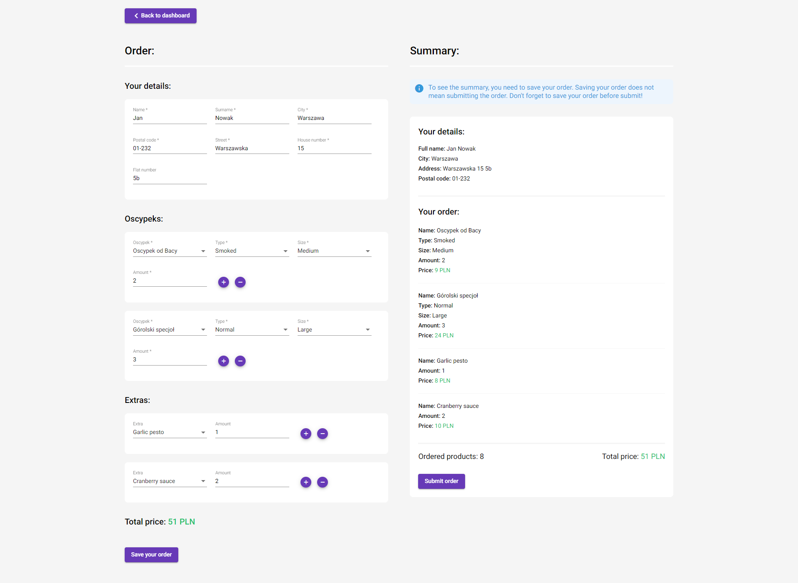

<h1 align="center">Omega Code Application</h1>

<h3 align="center">Oscypeks shop</h3>
<h5 align="center">
	Made by: 
	<a href="https://www.linkedin.com/in/karol-modzelewski/" target="_blank">Karol Modzelewski</a>
</h5>

## Navigation

- [Getting started](#getting-started)
	* [Download application](#download-application)
	* [Run application](#run-application)
	* [Helpful commands](#helpful-commands)
- [Tools and technologies](#tools-and-technologies)
- [Quick overwiew](#quick-overwiew)
  * [Dashboard](#dashboard)
  * [Client's view](#clients-view)
  * [Shepherd's view](#shepherds-view)
- [Any questions?](#any-questions)

## Getting started

### Download application:
 1. Download repository or clone it using `git clone https://github.com/karolmodzelewski/omega-code.git` command in your empty folder
 2. Install all dependencies `npm i`

### Run application:
 1. Run frontend:
 - `npm run start` or `ng serve` - if you want to run application in your language (default: English) - runs on `localhost:4200`
 - `npm run start:en` - run application with english language configuration - runs on `localhost:4201`
 - `npm run start:pl` - run application with polish language configuration - runs on `localhost:4202`

2. Run JSON Server:
- `npm run mock:server` - runs mock server to handle mock data from 'backend'

### Helpful commands

- `npm run test` - run all tests
- `npm run i18n:extract` - creates new translations and updates `messages.json` file
- `npm run lint` - lint application basen on `.eslintrc.json` configuration file 
- `npm run lint:fix` - lint application and automatically fixes errors and warnings (if it's supported by specific rules)

## Tools and technologies

 - Angular 14
 - Angular Material 14
 - RxJS 7
 - TypeScript 4
 - Karma 6
 - Jasmine 4
 - ESLint
 - JSON Server
 - i18n

## Quick overview

### Dashboard

Dashboard (EN) | Dashboard (PL)
-|-
  |  

### Client's view

Client's view loading (EN) | Client's view loading (PL)
-|-
  |  

Client's view error (EN) | Client's view error (PL)
-|-
  |  

Client's view success (EN) | Client's view success (PL)
-|-
  |  

Client's view form validations (EN) | Client's view form validations (PL)
-|-
  |  

Client's view form filled (EN) | Client's view form filled (PL)
-|-
  |  

Client's view error form with summary (EN) | Client's view error form with summary (PL)
-|-
  |  

Client's view with summary loading (EN) | Client's view with summary loading (PL)
-|-
  |  

Client's view form with summary error (EN) | Client's view form with summary error (PL)
-|-
  |  

Client's view form with summary success (EN) | Client's view form with summary success (PL)
-|-
  |  

### Shepherd's view

Shepherd's view list of orders loading (EN) | Shepherd's view list of orders loading (PL)
-|-
  |  

Shepherd's view list of orders error (EN) | Shepherd's view list of orders error (PL)
-|-
  |  

Shepherd's view list of orders success (EN) | Shepherd's view list of orders success (PL)
-|-
  |  

Shepherd's view order details (EN) | Shepherd's view order details (PL)
-|-
  |  

Shepherd's view filters (EN) | Shepherd's view filters (PL)
-|-
  |  

Shepherd's view no data (EN) | Shepherd's view no data (PL)
-|-
  |  

## Any questions?

If you have any questions or found some bugs or anything, feel free to contact me - I will be happy to answer :)

## Easter egg (meme)

Well, maybe not hidden well, but when I read about the topic of the application, this came to my mind:

